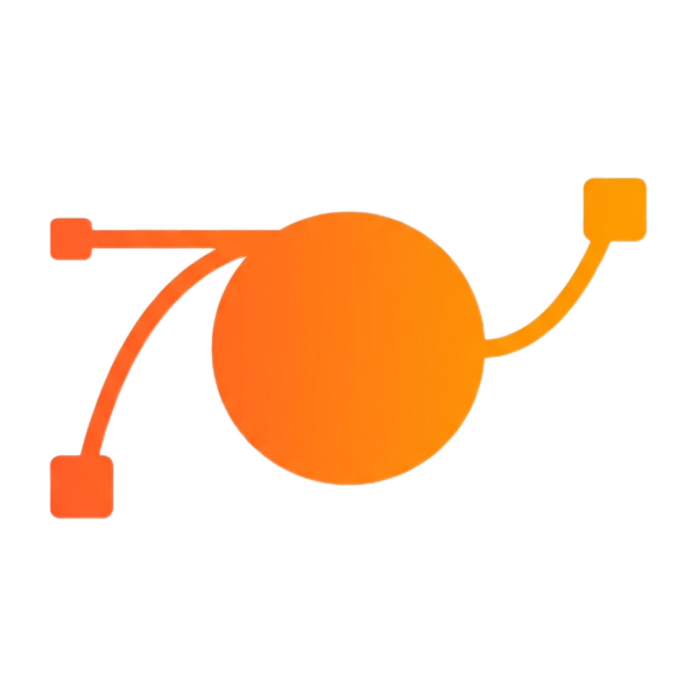

<p align="center">
  
</p>

<h1 align="center">Vexel</h1>

<p align="center">
  <strong>The Vector Graphics Engine for the Web</strong>
  <br>
  Build design tools, diagram editors, whiteboards, and creative applications.
</p>

<p align="center">
  
  
  
  
  
</p>

---

## Overview

Vexel is a professional-grade vector graphics engine written entirely in JavaScript. It provides a complete toolkit for building browser-based design applications — from simple drawing tools to full-featured collaborative design platforms.

Vexel handles the hard parts:

- Rendering
- Path mathematics
- Boolean operations
- Text layout
- Animation
- Export

You focus on building your product.

### Example

```javascript
const vex = new Vexel({
  container: '#canvas',
  width: 800,
  height: 600
});

vex.rectangle(100, 100, 200, 150, {
  fill: '#FF5722',
  cornerRadius: 12
});

vex.ellipse(400, 300, 80, 80, {
  fill: 'linear-gradient(135deg, #FF5722, #FF9800)'
});

const svg = vex.exportSVG();
const png = await vex.exportPNG(2);
```

---

## Installation

### CDN

```html
<script src="https://cdn.jsdelivr.net/gh/spideythedev/vexel@main/dist/vexel.js"></script>
```

### Download

Download `vexel.js` and include it in your project.

### Source

```bash
git clone https://github.com/spideythedev/vexel.git
```

---

## Examples

### Basic Drawing

```javascript
const vex = new Vexel({
  container: '#app',
  width: 800,
  height: 600
});

const rect = vex.rectangle(50, 50, 200, 150, {
  fill: '#FF5722',
  stroke: '#000',
  strokeWidth: 2,
  cornerRadius: 12
});

const circle = vex.ellipse(400, 300, 100, 100, {
  fill: 'radial-gradient(circle, #FF5722, #FF9800)'
});

const line = vex.line(50, 300, 750, 300, {
  stroke: '#000',
  strokeWidth: 3,
  strokeDash: [8, 4]
});
```

### Path Drawing

```javascript
const path = vex.path([
  { x: 100, y: 100 },
  { x: 200, y: 50 },
  { x: 300, y: 150 },
  { x: 250, y: 250 },
  { x: 100, y: 200 }
], {
  fill: '#FF5722',
  stroke: '#000',
  strokeWidth: 2,
  closed: true
});
```

### Boolean Operations

```javascript
const circle1 = vex.ellipse(200, 200, 80, 80, {
  fill: '#FF5722'
});

const circle2 = vex.ellipse(260, 200, 80, 80, {
  fill: '#3B82F6'
});

const union = vex.boolean.union([circle1, circle2]);
const intersection = vex.boolean.intersect([circle1, circle2]);
const difference = vex.boolean.subtract(circle1, circle2);
```

### Animation

```javascript
const timeline = new VexelTimeline(vex);

timeline.to(rect, {
  x: 400,
  y: 300,
  rotation: 360,
  opacity: 0.5
}, {
  duration: 2000,
  easing: 'easeInOutCubic'
});

timeline.play();
```

### Export

```javascript
const svg = vex.exportSVG();
const json = vex.exportJSON();
const png = await vex.exportPNG(2);
const pdf = vex.exportPDF();
const figma = vex.exportFigma();
const lottie = vex.exportLottie();
```

---

## Features

### Shapes

| Shape | Description |
|---------|-------------|
| Rectangle | Rounded corners, individual radius control |
| Ellipse | Circle, ellipse, arc, pie slice |
| Polygon | Regular polygons, stars |
| Line | Single line, polyline, with arrows |
| Path | Freehand, bezier curves, complex paths |
| Text | Multi-line, rich text, text on path |
| Image | Raster images with transforms |
| Group | Nested groups with transforms |
| Frame | Artboards with clipping and presets |
| Connector | Smart shape-to-shape connectors |

### Styling

- Solid fills with hex, rgb, rgba, and hsl
- Linear, radial, and conical gradients
- Pattern fills
- Stroke width, dash, cap, and join controls
- Opacity and blend modes (30+)
- Shadow, blur, and glow effects

### Typography

- Custom font loading (TTF, OTF, WOFF2)
- Rich text with mixed styles
- Text wrapping and auto-fit
- Text on any path
- Vertical text
- Ligature support

### Boolean Operations

- Union
- Subtract
- Intersect
- Exclude
- Convex hull computation
- Polygon offset and simplification

### Export Formats

- SVG 1.1
- PNG (1x, 2x, 4x)
- JPEG
- WebP
- AVIF
- PDF (vector)
- EPS (PostScript)
- JSON (`.vexel`)
- Figma
- Sketch
- Lottie

### Canvas

- Infinite zoom (0.001x to 100x)
- Smooth pan with inertia
- Customizable grid
- Rulers and guides
- Snap to grid
- Overscroll bounce

### Animation

- Timeline with play, pause, seek, and reverse
- 40+ easing functions
- Spring physics
- Shape morphing
- Path following
- Color interpolation

### Collaboration

- Real-time sync engine
- CRDT conflict resolution
- Remote cursors
- User presence
- Version history

---

## Architecture

Vexel is organized into focused modules, each responsible for a specific domain:

```text
src/
├── core/           Engine, renderer, canvas, viewport, events, scene graph
├── shapes/         Rectangle, ellipse, polygon, path, text, image, group, frame
├── path-engine/    Bezier math, splines, arcs, offset, simplify, intersection
├── boolean/        Union, subtract, intersect, polygon operations
├── transform/      Matrix, translate, rotate, scale, skew, warp
├── style/          Fill, stroke, shadow, blur, color, blend modes
├── typography/     Font loading, text layout, rich text, text on path
├── layers/         Layer management, compositing, visibility
├── tools/          Select, pen, pencil, brush, shape tools
├── export/         SVG, PNG, PDF, EPS, Figma, Sketch, Lottie, JSON
├── animation/      Timeline, tween, spring, morph, path animation
├── collab/         Sync, cursor, presence, conflict resolution
├── plugins/        Auto-layout, grid system, constraints, components
└── utils/          Math, geometry, color, DOM, events, performance
```

---

## Products Built on Vexel

- **Vexel Studio** — Professional design application
- **Vexel Flow** — Diagram and flowchart builder

---

## Browser Support

Vexel supports all modern browsers with Canvas 2D support.

| Chrome | Firefox | Safari | Edge |
|---------|---------|---------|---------|
| 90+ | 88+ | 14+ | 90+ |

WebGL 2 backend is available for optional GPU-accelerated rendering.

---

## Contributing

Vexel is an open-source project by FlamicsLLC.

Contributions, issues, and feature requests are welcome.

1. Fork the repository
2. Create a feature branch
3. Commit your changes
4. Submit a pull request

---

## License

MIT © FlamicsLLC

---

## Credits

Vexel is built and maintained by **spideythedev** for **FlamicsLLC**.

Special thanks to the open-source community for inspiration and to the web platform for making powerful graphics possible in the browser.

---

<p align="center">
  <strong>Vexel</strong> — Built for scale. Designed for precision.
  <br>
  <sub>By FlamicsLLC</sub>
</p>